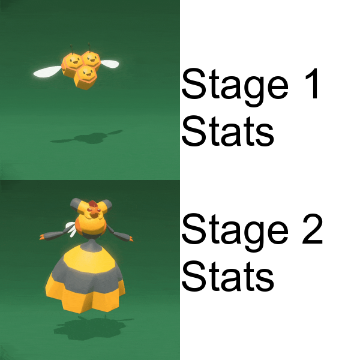

# Welcome to my website!

## This isn't the best meme in the world, it's just a tribute!
At the moment my site just contains memes like this one I have made for Stats220 using R.



However, I would like to use it as a portfolio of sorts in the future.
Code used to create it:
```
library(tidyverse)
library(magick)
library(purrr)

# bring in the Combee GIF (which I made :D )
combee <- image_read('https://media.giphy.com/media/v4e5pSmeK65jhaJwqF/giphy-downsized-large.gif') %>% 
  image_scale(300)

# bring in the Vespiquen GIF (which I also made :D )
vespiquen <- image_read('https://media.giphy.com/media/Jf39wqEKDkI4iXiqGi/giphy-downsized-large.gif') %>% 
  image_scale(300)

# append one frame from the two GIFs together (because both full GIFs are a little much to handle)
combo <- image_append(c(combee[10],vespiquen[10]), stack = TRUE)

# create a square to have the text in front of
square_2 <- image_blank(600,600,'white')

# put it all together
my_meme <- image_composite(square_2, combo) %>%
  image_annotate("Stage 1\nStats", size = 70, gravity = "northwest", color = "black", location = "+300+100") %>%
  image_annotate("Stage 2\nStats", size = 70, gravity = "southwest", color = "black", location = "+300+100")

# display to check everything has worked as intended
my_meme

# write it to a PNG file
image_write(my_meme, path = "my_meme.png", format = "png")

```
The reason I wanted to make this meme was because there aren't enough good bug type Pokemon memes in the world (in my opinion). And what is better than a bug type Pokemon meme you might ask ... one that includes Stats as well of course. Because orange jacket guy is rejecting one option and embracing the other I wanted to make something that was positive for both options while still showing some change. So I chose a bug Pokemon (Combee) and it's evolution (Vespiquen) and had them act in an excited manner for the GIFs.

### What makes this tribute so great?
1. Stats is an interesting subject and gets a bad rap universally, probably because it gets misused to spread bad information.
2. Honestly, because I love Pokemon. And my favourite type to play with in any game is the Bug type.
3. The orange jacket guy meme has been over done and Stats is **always** fun ... just the level of excitement changes.

Also, in no particular order:
- Bugs are generally increadible creatures, able to survive in the harshest environments and perform feats that would be *impossible* for us mere humans.
- The Pokemon franchise is fun and wholesome entertainment that has something for everyone, both children and adults alike.
- Everyone needs a little lighthearted fun in their lives.

---

I made a lot of GIFs (it's was surprisingly easy, although a little tedious).
Here is my Heracross looking excited, hosted on my GIPHY page, enjoy :D .


